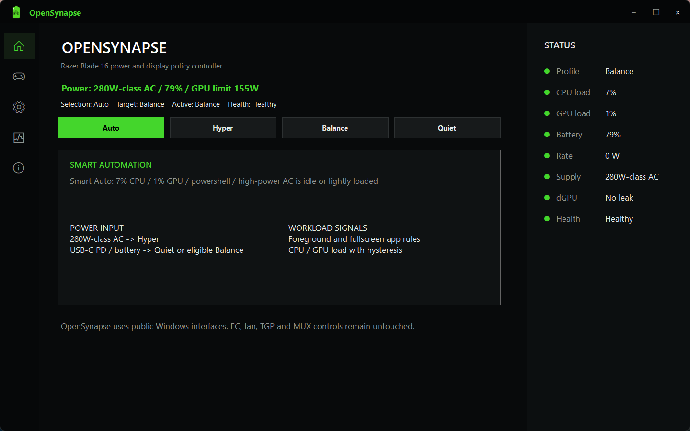
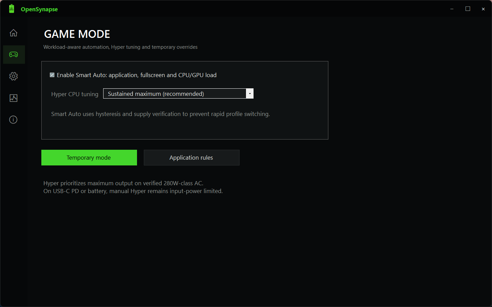
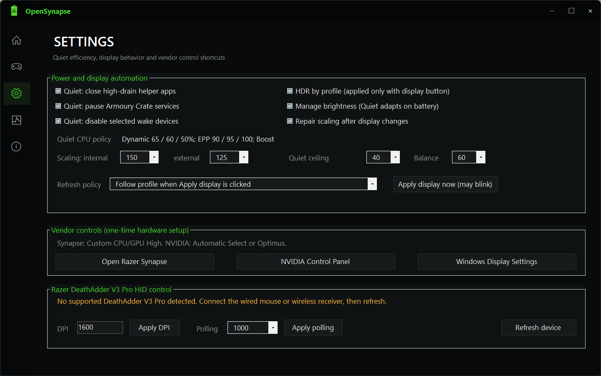
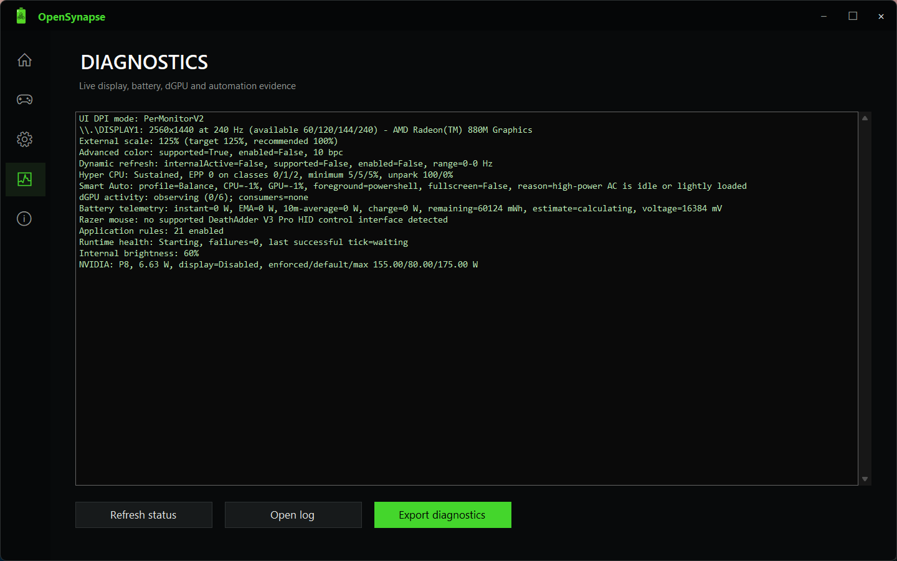
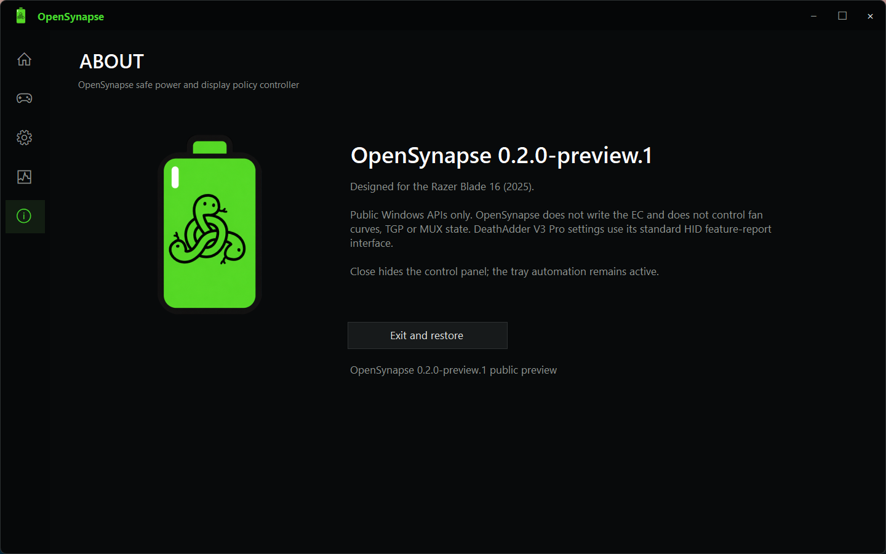

# OpenSynapse

[English](README.md) | [简体中文](README.zh-CN.md)

[](https://github.com/Hariketsu/OpenSynapse/actions/workflows/build.yml)
[](https://github.com/Hariketsu/OpenSynapse/releases)
[](LICENSE)
[](https://www.microsoft.com/windows/windows-11)

OpenSynapse 是一个本地优先的 Windows 控制中心，用于管理电源、显示、自动化和部分 Razer HID 能力。它应用明确的系统策略，记录可检查的本地状态，并为已修改的系统状态保留恢复路径。

> **0.2.0-preview.1 是首个公开预览版。** 这是一个有明确适用范围的版本，不是通用的游戏本控制工具。

## 适合谁使用

OpenSynapse 面向需要观察并可恢复电源、显示行为的 Windows 11 系统。当前主要验证环境是 Razer Blade 16（2025），型号 `RZ09-0528`。

| 领域 | 0.2.0-preview.1 可用能力 | 证据与边界 |
| --- | --- | --- |
| 电源策略 | Auto、Hyper、Balance、Quiet；电源方案与电池感知自动化 | 已在目标系统验证；策略值受硬件和固件影响 |
| Smart Auto | 应用、全屏、CPU/GPU 负载、供电分类与迟滞信号 | 缺少硬件证据时会保守回退 |
| 显示策略 | 刷新率、HDR/Advanced Color、内屏亮度和缩放 | 已在目标系统验证；外接显示器行为有明确限制 |
| 状态恢复 | 原始状态捕获、本地原子文件、卸载/退出恢复 | 目标是恢复已追踪状态；安装前请阅读安全说明 |
| Razer 鼠标 | DeathAdder V3 Pro 发现、状态、DPI 和标准接收器轮询率控制 | 在连接目标设备完成读写验证前，保持实验性 |

### 当前不支持

固件更新、风扇曲线、CPU/GPU 功耗限制、MUX 切换、未公开 EC 写入、内核驱动、云端账户、自动更新和运行时网络服务不在当前范围内。

## 项目截图

以下截图来自目标设备的一次运行，展示的是 UI 和当时的瞬时遥测；其中的电源、电池、显示和 GPU 数值不是通用默认值。

### 控制面板



### 游戏模式



### 设置



设置截图显示了未连接受支持 DeathAdder V3 Pro 时的安全状态。只有检测到精确白名单设备后，HID 写入才会启用。

### 诊断



### 关于与恢复



关闭窗口只会隐藏控制面板。**Exit and restore** 才会停止托盘运行时并恢复已追踪的状态。

## 快速开始

### 要求

- Windows 11；
- Windows PowerShell 5.1；
- 安装和系统策略变更需要管理员确认；
- 建议使用可随时恢复、配置完全明确的系统进行预览测试；
- 测试 Razer HID 控制时请关闭 Razer Synapse。

### 预览包

首个公开预览包通过 GitHub Pre-release `v0.2.0-preview.1` 发布，提供 Setup 安装器、ZIP 包、发布说明和 SHA-256 校验值。

### 从源码构建

在 Windows PowerShell 5.1 中运行：

```powershell
powershell -ExecutionPolicy Bypass -File scripts\Test-InstallerDefinitions.ps1
powershell -ExecutionPolicy Bypass -File scripts\Test-Milestones.ps1
powershell -ExecutionPolicy Bypass -File scripts\Publish-OpenSynapse.ps1
```

发布产物为 `artifacts\OpenSynapse-Setup-0.2.0-preview.1.exe` 和 `artifacts\OpenSynapse-0.2.0-preview.1.zip`。

### 安装与恢复

从解压后的发布目录运行：

```powershell
powershell -ExecutionPolicy Bypass -File .\OpenSynapse.ps1 -Mode Install
powershell -ExecutionPolicy Bypass -File .\OpenSynapse.ps1 -Mode Status
powershell -ExecutionPolicy Bypass -File .\OpenSynapse.ps1 -Mode SelfTest
powershell -ExecutionPolicy Bypass -File .\OpenSynapse.ps1 -Mode Uninstall
```

安装会创建一个延迟启动、最高权限、当前用户范围的计划任务，并把配置和回滚状态存放在 `%LOCALAPPDATA%\OpenSynapse`。预览版安装到无法恢复的机器前，请先检查生成的状态文件。

在可恢复的测试系统上运行完整管理员套件：

```powershell
powershell -ExecutionPolicy Bypass -File scripts\Test-Milestones.ps1 -AdminRelease
```

可选的鼠标写入检查需要连接并可读取的 DeathAdder V3 Pro；它会把设备当前报告的数值写回，不会主动选择新参数：

```powershell
powershell -ExecutionPolicy Bypass -File scripts\Test-Milestones.ps1 -TestMouseWrites
```

## 安全与隐私

- 运行时仅在本地工作；不包含账户、云服务、分析客户端、自动更新器或必需的网络连接。
- 安装版是一个提权的 PowerShell 5.1/WinForms 托盘进程，不安装内核驱动。
- 配置和捕获状态分开保存为 `%LOCALAPPDATA%\OpenSynapse` 下的原子文件。
- Razer 写入要求 VID `1532`、精确支持的 PID 和 Consumer HID Usage Page。DPI 与轮询率在构造报文前验证，响应会校验请求和校验和。
- Quiet 的唤醒设备、服务和辅助进程操作使用本地白名单并保留恢复状态。安装前请检查这些列表。
- `nvidia-smi` 只用于读取适配器证据。证据缺失或含糊时会安全回退，不会擅自提升到性能策略。
- 产品名称相同不代表设备已支持。目标笔记本中发现的 DeathAdder PID `02C6` 实际属于内置键盘，不是受支持的鼠标接口。

## 已知限制

- 只有在确认高功率 AC 后，Hyper 才会执行预期的最大输出策略。USB-C PD、电池和未确认 AC 会受输入功率限制。
- 外接显示器刷新行为受到明确限制；项目不宣称通用的外屏刷新率控制。
- 白名单中的 DeathAdder V3 Pro 有线和接收器 PID 仍待完成真实硬件读写验证。
- 安装和回滚证据目前覆盖命名的目标环境，不代表所有 Windows 11 笔记本、GPU、显示器或固件组合。
- 显示链路或显示器控制器故障不一定能由用户态软件修复。运行时会检测缺失或不稳定证据，并避免对不安全的拓扑强写。

## 文档

- [架构说明](docs/ARCHITECTURE.md)
- [路线图与成熟度门槛](ROADMAP.md)
- [变更记录](src/OpenSynapse.PowerShell/CHANGELOG.md)
- [贡献指南](CONTRIBUTING.md)
- [安全策略](SECURITY.md)
- [行为准则](CODE_OF_CONDUCT.md)
- [第三方声明](THIRD_PARTY_NOTICES.md)

## 参与贡献

硬件贡献必须提供可复现的设备身份和验证证据。只有产品名称相同不足以将设备标记为受支持。修改能力边界前，请先阅读贡献指南和路线图。

## 许可证与商标

OpenSynapse 使用 [GNU GPL v2 only（`GPL-2.0-only`）](LICENSE)许可证。它是独立社区项目，与 Razer Inc. 不存在附属、认可或赞助关系。Razer、Razer Synapse 及相关产品名称是其各自所有者的商标。
