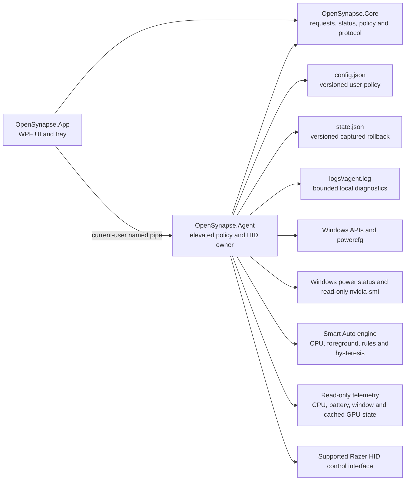
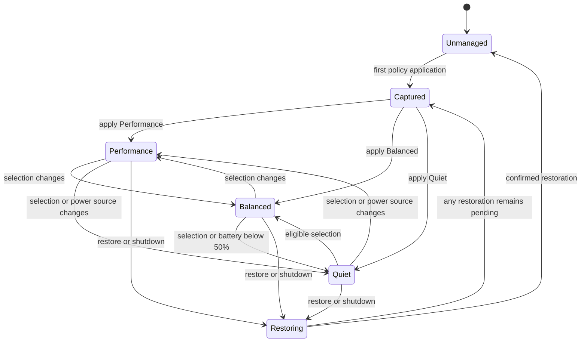

# OpenSynapse architecture

## Goals

OpenSynapse keeps privileged work small, visible, and reversible. Device support is explicit: a product is supported only when its identity, transport, commands, and verification evidence are known.

## Components

### OpenSynapse.App

Runs without elevation. It displays status, edits validated display-policy settings, and sends typed requests to the agent. Closing the window hides it; explicit exit requests restoration and agent shutdown. It never writes configuration, Windows policy, or HID state directly.

The App and serving Agent each hold a per-user named single-instance lease. A second App launch signals the existing window to activate; a second serving Agent exits without competing for policy ownership. The App uses `OpenSynapse.Desktop` as its explicit Windows AppUserModelID and uses the migrated OpenSynapse application/tray ICO resources.

### OpenSynapse.Agent

Runs elevated for the current user. It owns mode selection, power-source reactions, state capture, restoration, Windows policy changes, exact-allowlist wake-device permissions, device enumeration, HID commands, bounded local logs, and read-only diagnostics. The named pipe accepts only the current user and one bounded JSON request per connection.

Display changes are debounced before the active policy is reapplied. Newly active displays are appended to the rollback snapshot before scaling or Advanced Color changes; existing snapshots are never replaced by hot-plug state. Normal Smart Auto mode transitions are seamless by default: refresh, HDR, scaling and brightness are only applied by an explicit display action or a real display-topology event.

The Smart Auto engine is deterministic and platform-independent. It combines trusted supply classification, battery safety limits, foreground/fullscreen process rules, optional Running rules, CPU samples, hysteresis and minimum dwell. The Windows telemetry adapter supplies CPU, foreground-window, lock-state, Battery Class data, and cached GPU Performance Counter/DXGI data. GPU sampling runs in a background worker; the strategy loop never invokes a vendor GPU command.

Temporary modes live in the rollback state rather than changing the persistent selection. They expire at a bounded duration or on a supply-class change and are always rechecked against the Balance battery threshold.

When display-policy configuration changes, the agent validates the complete replacement, confirms restoration of the previous display snapshot, clears the active-mode marker, atomically saves the new configuration, and applies the resolved mode again. A failed restore leaves the prior configuration unchanged for a deliberate retry.

### OpenSynapse.Core

Contains shared request/status models, fail-safe supply classification, deterministic mode selection, Smart Auto/app-rule decisions, temporary-mode data and device packet construction/validation. Logic that can be independent of Windows or hardware belongs here and leaves a runnable test.

## State transition

The Captured State is not deleted merely because a restore was attempted. Each value is cleared only after its restoration is confirmed or it is intentionally retained for a later retry.

## Trust boundaries

- The UI-to-agent pipe crosses a Windows integrity boundary. Access is restricted to the current user; JSON enums, sizes, ranges, operations, and device identities are validated. Destructive uninstall cleanup is excluded from the pipe and is available only through the elevated maintenance CLI.
- The configuration and state files are current-user writable and are not sources of arbitrary executable commands or file paths. They use independent schemas so user policy cannot erase rollback evidence.
- Automatic Performance requires a high-power AC classification. Adapter probing is read-only, cached, and falls back to Quiet when unavailable or ambiguous.
- Quiet wake-device maintenance is disabled by default and uses exact device-name equality, never wildcard patterns. Rollback intent is saved before disabling a permission; tracked entries are cleared only after `wake_armed` confirms restoration. Process termination and vendor-service control are intentionally excluded because they cannot provide the same rollback guarantee.
- Uninstall cleanup is ordered: confirmed display/power restoration, GUID-and-name verification of every managed power plan, verified plan deletion, then task/shortcut/file removal. Failure preserves the installation for retry.
- HID writes require Razer VID `1532`, an explicitly supported PID, and Consumer usage page `0x0C`.
- Unknown status, response mismatch, checksum failure, and unsupported values fail closed.
- Firmware and embedded-controller writes are outside the boundary.

## Adding device support

1. Record exact VID/PID, transport role, usage page, firmware, and connection type.
2. Establish legally shareable protocol provenance.
3. Implement pure packet construction and response validation in Core.
4. Add the smallest packet-level regression check.
5. Gate transport access on the exact capability identity.
6. Verify reads, writes, failure behavior, and rollback on owned or authorized hardware.
7. Update the public device matrix with the verified combination.

The current DeathAdder path remains direct. A general provider or plugin abstraction should be introduced only when a second maintained driver demonstrates a real common interface.

## Prototype boundary

The native display helper migrated from PowerPilot now lives under `src/OpenSynapse.Agent/Windows/`. Prototype and protocol references under ignored `ref/` are evidence only and must never be build dependencies.
