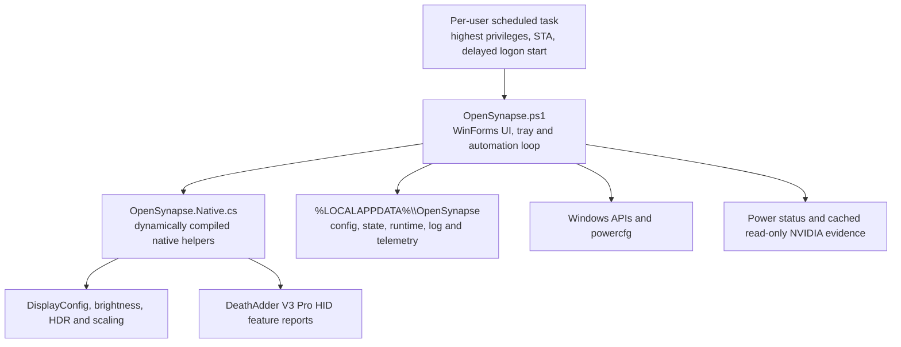

# OpenSynapse architecture

## Release runtime

OpenSynapse 0.2.0-preview.1 uses the single-process Windows PowerShell 5.1 execution model because it has already passed the target-machine installation, power-policy, display, DPI and stability test suite.

The UI and policy engine live in the same elevated per-user process. There is no WPF-to-Agent named pipe, no second startup authority and no period where the panel can be open while its backend is offline. Closing the window hides it; the tray process and automation loop continue. “Exit and restore” returns tracked power, display, wake and service state before stopping.

## Components

### OpenSynapse.ps1

The script is the product entry point and owns:

- installation, upgrade migration, uninstallation and the Start menu shortcut;
- the delayed highest-privilege scheduled task;
- Auto, Hyper, Balance and Quiet selection;
- supply classification, debounce and Smart Auto hysteresis;
- application rules, temporary modes and runtime health backoff;
- reversible power, brightness, HDR, scaling, refresh, wake-device and maintenance state;
- the five-page WinForms UI, custom title bar, tray menu, diagnostics and exports;
- calls into the native display, telemetry and Razer HID helpers.

Installation stops the obsolete `OpenSynapse Agent` runtime before removing it. When its executable is still present, `uninstall-cleanup` performs the original implementation's verified rollback. If only its schema-10 JSON remains, the PowerShell installer recognizes that distinct schema, directly restores the captured power/display/brightness/wake state, maps user configuration into the 2.4.1-compatible fields, and archives the legacy JSON so it cannot later be mistaken for a PowerShell runtime backup. An installed PowerPilot instance is then handed to its own restore/uninstall path; its config and state are archived first and its compatible config is promoted to OpenSynapse. Only after both prior policy engines have stopped are their old tasks/directories removed and the single OpenSynapse runtime registered.

### OpenSynapse.Native.cs

Windows PowerShell 5.1 dynamically compiles this helper with `Add-Type`. It contains the native API boundaries used by the script:

- per-monitor DPI and taskbar AppUserModelID;
- custom window dragging, dark frames and dark controls;
- CPU, battery, foreground-window, GPU and power-event telemetry;
- display mode, native dynamic refresh, scaling and Advanced Color operations;
- capability-gated DeathAdder V3 Pro HID discovery and feature reports.

The Razer path accepts only VID `1532`, PIDs `00B6`, `00B7`, `00C2` or `00C3`, and HID Usage Page `0x0C`. DPI is limited to 100–30000; standard-receiver polling is limited to 125, 500 or 1000 Hz. Responses must match the transaction, command class, command ID and checksum.

This is a user-mode HID feature-report implementation. It does not install a kernel driver, flash firmware or access the embedded controller.

### Retained .NET code

`OpenSynapse.sln`, `OpenSynapse.Core`, the former WPF App and the former Agent remain in the repository for protocol regression tests and migration history. They are not copied by `scripts/Publish-OpenSynapse.ps1` and are not the installed desktop runtime.

## State and recovery

Configuration and rollback state are separate under `%LOCALAPPDATA%\OpenSynapse`:

- `config.json` contains the persistent user selection and policy settings;
- `state.json` contains original and managed power-plan identities plus reversible wake, service, brightness and color state;
- `runtime.json` identifies the live tray process and health;
- `OpenSynapse.log` records bounded local events;
- `telemetry.jsonl` stores the rotating local telemetry history.

The runtime uses atomic JSON replacement and `.bak` recovery behavior. A transient monitor failure does not switch profiles blindly: the last verified plan is preserved and monitoring backs off through 10/20/40/60-second retries.

## Test boundary

`scripts/Test-Milestones.ps1` runs the non-destructive definition and telemetry suite. `-AdminRelease` runs the inherited reversible administrator suite, including installation and power-plan round trips. `-TestMouseWrites` writes the mouse's currently reported DPI and polling values back to the same supported device.

Packet construction is testable without hardware. A hardware support claim still requires a connected target device and successful read/write verification.
